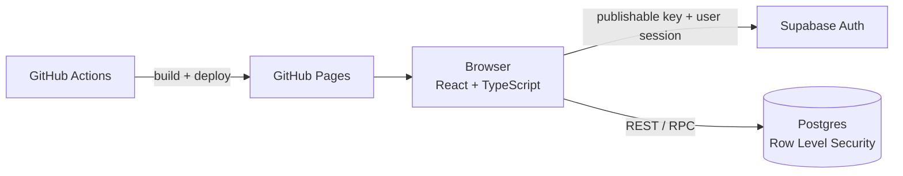

# spendings-list

A phone-first web app for a family to log and review everyday expenses. It replaced a shared Google Sheet that had become slow, especially for monthly reports.

Everyone logs in with a name and a 6-digit PIN, adds expenses in a few taps, and sees their own monthly summary. An admin sees the whole family.

<!--
Screenshots: put images in docs/screenshots/ (use demo data only, never real expenses or names), then uncomment:

<p>
  
  
  
</p>
-->

## Features

- **Fast entry:** add an expense with amount, category, date and description.
- **Personal templates:** repeating expenses (rent, subscriptions, phone bills) become one-tap chips; amount and description stay editable before saving.
- **Monthly reports:** totals by member, by category, by both, and for the whole family.
- **Roles:** members see only their own expenses; the admin sees everyone's.
- **Trash:** deleting an expense moves it to a trash; the admin can restore it or delete it permanently.
- **Category management (admin):** add, rename, reorder, and hide categories without losing history.
- **Safe retries:** a lost response never creates a duplicate expense.
- **Offline-tolerant:** expenses added without a connection wait in a local queue and are sent when the connection returns.
- **Auto logout:** the session ends after 10 minutes of inactivity.
- **Smooth, calm UI:** CSS-only transitions that respect `prefers-reduced-motion`.

## Tech stack

| Layer | Choice |
| --- | --- |
| Frontend | React, TypeScript, Vite |
| Backend | Supabase: Postgres, Auth, Row Level Security |
| Hosting | GitHub Pages, deployed by GitHub Actions |

There is no server code of our own. The browser talks to Supabase directly with the public (publishable) key, and all access rules live in the database.

## Architecture



Data model: `profiles`, `categories`, `expenses`, `templates`, plus a `monthly_totals` view for reports. The full schema, policies and functions are in [`supabase/schema.sql`](supabase/schema.sql).

## Design decisions

- **Security lives in the database.** The publishable key is safe in the browser only because Row Level Security is on for every table. Members can read and change only their own rows; the admin check is a `security definer` helper. Anonymous access is revoked.
- **No secret keys in the client.** The `service_role` / secret key is never used or committed. Operations that would need it, such as creating users, are done in the Supabase dashboard.
- **Soft delete.** Expenses are marked with `deleted_at` through a `delete_expense()` function. RLS hides trashed rows from members and prevents them from un-deleting.
- **Idempotent writes.** Each new expense gets a client-generated UUID (`client_id`, unique). If a response is lost and the app retries, the database rejects the duplicate and the app treats it as success.
- **Reports in SQL.** `monthly_totals` aggregates by member, category and month with `security_invoker`, so the same view is correctly filtered for members and complete for the admin.
- **Per-device logout.** Auto logout uses `signOut({ scope: 'local' })` so signing out on one device does not end the user's sessions elsewhere, and it clears locally cached data.
- **Login by name and PIN.** The typed name becomes an internal email (`<name>@spendings.app`) and the PIN is the password, which keeps Supabase Auth's session handling without asking family members for an email address.

A 6-digit PIN is a convenience-level credential suited to a small private app, not to sensitive data.

## Getting started

### 1. Supabase project

1. Create a new Supabase project.
2. In **Authentication**, turn off *Allow new users to sign up* and *Confirm email*.
3. Open **SQL Editor** and run [`supabase/schema.sql`](supabase/schema.sql) on the empty project.
4. Create the users: **Authentication → Users → Add user**, with the email `<name>@spendings.app` (lowercase Latin letters), the 6-digit PIN as the password, and *Auto Confirm User* ticked.
5. Make one user the admin:
   ```sql
   update public.profiles set is_admin = true where name = '<name>';
   ```

### 2. Run the frontend locally

```bash
cd frontend
npm ci
npm run dev
```

Set `SUPABASE_URL` (without `/rest/v1/`) and `SUPABASE_PUBLISHABLE_KEY` in `frontend/src/config.ts`. The publishable key is safe to commit. Never use a secret or `service_role` key here.

### 3. Checks

```bash
npm run typecheck
npm run build
```

## Deployment

Pushing to `main` builds `frontend` and publishes `frontend/dist` to GitHub Pages (`.github/workflows/deploy.yml`).

## Project structure

```
frontend/              React + TypeScript + Vite app
supabase/schema.sql    Database schema, RLS policies, functions, report view
.github/workflows/     Build and deploy to GitHub Pages
CLAUDE.md              Notes for AI-assisted development
```

The app was built with AI assistance (Claude Code); `CLAUDE.md` documents the conventions it follows.

## Roadmap

- Member management inside the app (needs a privileged server-side function)
- Smooth animations for deleting and reordering rows
- Demo deployment with sample data
